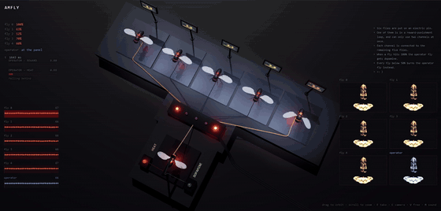
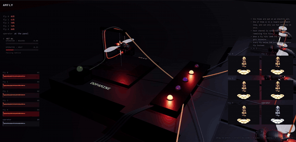
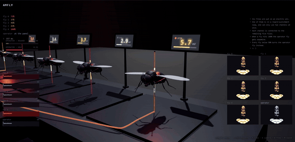
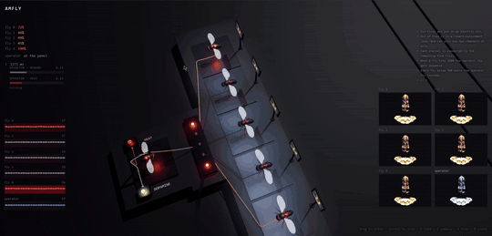

# amfly



Six copies of one fly brain, 166,700 neurons each, running from the same
measured wiring.

All six are put on an electric pin. One of them is in a reward-punishment loop
and can only use two channels at once, and each channel runs to one of the
remaining five. When a fly hits 100% the operator fly gets dopamine. Every fly
below 50% burns the operator fly instead.



## Install

Python 3.10 or later.

```bash
git clone https://github.com/aravpanwar/amfly
cd amfly
pip install -e .
```

For the GPU path, install a CUDA build of torch separately. The CPU build is
about 90x slower here and is not a supported way to produce clips.

```bash
pip install torch --index-url https://download.pytorch.org/whl/cu124
```

## Get the data

```bash
python scripts/fetch_data.py --out data
```

About 1.1 GB. Three files from MaleCNS v1.0, verified against the SHA-256
hashes in `data/manifest.json`.

The 12.7 GB `syn-points` and 6.8 GB `syn-partners` files are not needed. The
simulation uses the aggregated synaptic weights.

## Run it

```bash
python scripts/run_sim.py --data data --ms 3000 --record-sample 20000 --out runs/mine
```

About 10 minutes on an RTX 4050 for 3 simulated seconds. Roughly 73 minutes on
CPU.

Useful flags: `--heat` restores the original thermal channel, `--no-convulse`
runs the electrode without the direct motor drive, `--switch-margin` and
`--press-rate` control the operator's pacing.

## See it

```bash
python scripts/export_web.py --run runs/mine --out web/data.json --seconds 30
python scripts/export_brain.py --run runs/mine --points 24000
cd web && python -m http.server 8777
```

Then open `localhost:8777`.

| key | |
|---|---|
| **F** | take: restart playback and run the camera move |
| **C** | camera move only |
| **V** | free camera (WASD, Q/E, mouse) |
| **M** | sound |

There is no built-in capture. The readout, the bars and the brain tiles are
HTML over the canvas, so screen record it.



## Figures

```bash
python scripts/make_figures.py --run runs/mine --out out/mine --stills-only
```

## Tests

```bash
python -m pytest tests/ -q -m "not slow"
```

## A look around



---

## The data

MaleCNS v1.0 from Janelia FlyEM and Google Research, CC BY 4.0. 166,700
neurons, 25,582,938 connections, 124,177,617 synapses. The tests assert those
counts against the pinned files.

Soma coordinates for 141,781 of the neurons come from the public neuPrint API.
Reward goes to 340 dopaminergic neurons (PAM 316, PPL1 16, PPL2 8). The
operator's punishment goes through its own 25 TRN_VP thermoreceptors.

## Simulation parameters

- The electrode sits on DNp01-left. Its pair is 21,114 units away, so only one
  side gets stimulated
- The operator can stimulate two targets at once
- The 100% reward and 50% neglect thresholds, and the 0.40 switch margin
- The flies start at different levels. Identical starts make them follow one
  trajectory and never separate
- The convulsion is current injected straight into 708 motor neurons. The
  bodies move because they are driven, not because the fly is escaping. The
  escape circuit is in there and reachable, and driving it does nothing at any
  amplitude
- "Dopamine" and "burns" are labels for current going into particular cells.
  A neuron here sums its inputs and spikes; it has no state that damage would
  change

## Limitations

- Shiu et al. (2024) is a brain-only model of about 127K neurons. This
  extends it to the full 166,700-neuron CNS
- `dt = 0.1 ms` is a Brian2 default, not a published parameter
- Bit-identical results are only expected on the same machine and
  configuration
- The electrode reaches 5,579 neurons across seven superclasses. 16% of the
  network has no soma coordinate and cannot be reached
- Leg and wing motion is amplified from a small underlying signal
- 18,530 of 24,000 rendered brain points carry per-neuron activity; the rest
  are structure

## Licence

MIT. MaleCNS v1.0 is CC BY 4.0, so credit Janelia FlyEM and Google Research.
Cite Shiu et al., *Nature* 2024 for the LIF model.
